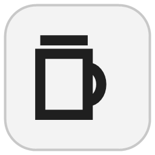

[![CI][ci-shield]][ci-url]
[![Release][release-shield]][release-url]
[![Issues][issues-shield]][issues-url]
[![License][license-shield]][license-url]

 

  

<h3 align="center">Kindly Bartender</h3>

  

    다른 창을 보고 있을 때 하스스톤 전장의 단계가 시작되면 알려 주는 Windows 트레이 앱입니다.
     
    <a href="README.md">English</a> | 한국어
     
     
    <a href="https://github.com/dev1f965x/kindly-bartender/releases"><strong>다운로드 »</strong></a>
     
     
    <a href="https://github.com/dev1f965x/kindly-bartender/issues/new?template=bug_report.yml">버그 제보</a>
    &middot;
    <a href="https://github.com/dev1f965x/kindly-bartender/issues/new?template=feature_request.yml">기능 요청</a>
  

  
목차

  <ol>
    <li>
      <a href="#프로젝트-소개">프로젝트 소개</a>
      <ul>
        <li><a href="#사용한-기술">사용한 기술</a></li>
      </ul>
    </li>
    <li>
      <a href="#시작하기">시작하기</a>
      <ul>
        <li><a href="#필요한-것">필요한 것</a></li>
        <li><a href="#설치">설치</a></li>
        <li><a href="#제거">제거</a></li>
      </ul>
    </li>
    <li><a href="#사용법">사용법</a></li>
    <li><a href="#로드맵">로드맵</a></li>
    <li><a href="#개인정보">개인정보</a></li>
    <li><a href="#개발">개발</a></li>
    <li><a href="#기여">기여</a></li>
    <li><a href="#라이선스">라이선스</a></li>
    <li><a href="#연락처">연락처</a></li>
    <li><a href="#감사의-말">감사의 말</a></li>
  </ol>

## 프로젝트 소개

![단계가 시작될 때 할 동작을 고르는 설정 창][product-screenshot]

하스스톤 전장용 Windows 트레이 앱입니다. 다른 창을 보고 있을 때 상점 단계가 시작되면 알려 줘서, 턴 타이머가 끝나기 전에 돌아올 수 있게 합니다.

아직 개발 중이며 출시된 버전은 없습니다.

Kindly Bartender는 비공식 팬 프로젝트이며 블리자드 엔터테인먼트와 제휴하거나 보증을 받지 않았습니다. Hearthstone은 Blizzard Entertainment, Inc.의 상표입니다.

변경 사항은 [변경 이력](CHANGELOG.md)에 있습니다.

(<a href="#readme-top">맨 위로</a>)

### 사용한 기술

* [![.NET][dotnet-shield]][dotnet-url]
* [![WPF][wpf-shield]][wpf-url]
* [![Velopack][velopack-shield]][velopack-url]
* [![xUnit.net][xunit-shield]][xunit-url]

(<a href="#readme-top">맨 위로</a>)

## 시작하기

### 필요한 것

Windows 10 버전 2004 이상 또는 Windows 11.

### 설치

1. [Releases](https://github.com/dev1f965x/kindly-bartender/releases)에서 `KindlyBartender-win-Setup.exe`를 내려받습니다. 현재 사용자에게만 설치되며 관리자 권한이 필요 없습니다.
2. 아직 코드 서명이 없어 SmartScreen이 인식할 수 없는 앱이라고 경고할 수 있습니다. 파일의 SHA-256을 `SHA256SUMS.txt`와 비교한 뒤(PowerShell에서 `Get-FileHash .\KindlyBartender-win-Setup.exe`) **추가 정보**와 **실행**을 선택하세요.
3. 시작 메뉴에서 Kindly Bartender를 열고 로그 설정 창을 따르세요. 동의한 뒤에만 하스스톤 설정 파일 두 개를 바꿉니다. 하스스톤이 실행 중이었다면 다시 시작하세요.

설치하지 않고 쓰려면 `KindlyBartender-win-Portable.zip`의 압축을 풀고 `Kindly Bartender.exe`를 실행하세요. 포터블 버전은 설정과 진단 기록을 자기 폴더에 보관합니다. 지우려면 설정에서 Windows 시작 시 실행을 끄고 트레이에서 종료한 뒤 폴더를 삭제하세요.

### 제거

**설정 > 앱 > 설치된 앱**(Windows 11) 또는 **설정 > 앱 > 앱 및 기능**(Windows 10)에서 제거합니다. 앱과 설정, 진단 기록, Windows 시작 시 실행 항목이 지워집니다. 덱 트래커 같은 다른 도구가 쓸 수 있어 하스스톤의 로그 설정은 그대로 둡니다. 되돌리려면 `%LOCALAPPDATA%\Blizzard\Hearthstone\log.config`에서 `[Power]` 섹션을, 하스스톤 폴더의 `client.config`에서 `FileSizeLimit.Int` 줄을 지우세요.

(<a href="#readme-top">맨 위로</a>)

## 사용법

Kindly Bartender는 트레이에서 실행됩니다. 평소처럼 하스스톤을 하세요. 솔로 전장에서 다른 창이 활성 창일 때 영웅 선택이나 상점 단계가 시작되면, **설정**의 **단계가 시작되면**에서 고른 동작을 합니다.

- 알림 표시. 알림을 선택하면 하스스톤으로 돌아갑니다.
- 소리 재생.
- 작업 표시줄에서 하스스톤 깜빡이기.
- 하스스톤 화면을 앞으로 가져오기. 키보드 입력은 지금 쓰던 창으로 계속 들어갑니다.

하스스톤이 활성 창이면 아무것도 하지 않습니다. 잠시 알림을 끄려면 트레이 메뉴에서 **알림 일시 중지**를 선택하세요. Windows 방해 금지가 켜져 있으면 알림이 숨겨질 수 있습니다. 알림을 받으려면 Windows 설정에서 Kindly Bartender를 우선순위 알림에 추가하세요.

이 앱은 하스스톤 로그를 읽습니다. 블리자드 최종 사용자 사용권 계약은 허가받지 않은 프로그램이 게임 데이터를 읽는 것을 금지하며, 블리자드가 계정에 제재를 가할 수 있습니다. 사용에 따른 책임은 사용자에게 있습니다.

(<a href="#readme-top">맨 위로</a>)

## 로드맵

- [ ] 인수 테스트
- [ ] 첫 출시(0.1.0)

(<a href="#readme-top">맨 위로</a>)

## 개인정보

Kindly Bartender는 개인정보를 수집하지 않으며 사용 통계도 보내지 않습니다.

- 시작할 때마다 GitHub(`api.github.com`)에 새 버전이 있는지 확인합니다. 다른 웹 요청과 마찬가지로 IP 주소와 앱 버전이 GitHub에 전달됩니다. 아무것도 내려받거나 설치하지 않습니다.
- `%LOCALAPPDATA%\KindlyBartender\data\logs`에 진단 기록을 하루 한 파일, 최대 일곱 개까지 남깁니다. 정해진 이벤트 이름, 숫자, 오류 종류만 기록하며 경로, 계정 이름, 게임 내용은 기록하지 않습니다. 문제를 신고할 때 첨부할 수 있으며, 앱이 어디로도 보내지 않습니다.

(<a href="#readme-top">맨 위로</a>)

## 개발

필요한 것: Windows 11과 [global.json](global.json)에 적힌 버전의 .NET SDK

명령 목록은 [README.md](README.md#development)의 표를 따릅니다.

(<a href="#readme-top">맨 위로</a>)

## 기여

버그 제보와 기능 요청은 유형별 양식이 있는 [GitHub 이슈](https://github.com/dev1f965x/kindly-bartender/issues/new/choose)로 남겨 주세요. 보안 문제는 [SECURITY.md](SECURITY.md)에 안내된 방법으로 비공개 제보해 주세요.

(<a href="#readme-top">맨 위로</a>)

## 라이선스

[MIT 라이선스](LICENSE)로 배포합니다. 각 릴리스에 제3자 고지가 들어 있습니다.

(<a href="#readme-top">맨 위로</a>)

## 연락처

프로젝트 주소: <https://github.com/dev1f965x/kindly-bartender>

(<a href="#readme-top">맨 위로</a>)

## 감사의 말

* [Best-README-Template](https://github.com/othneildrew/Best-README-Template): 이 README의 구성
* [Velopack](https://velopack.io): 설치 프로그램

(<a href="#readme-top">맨 위로</a>)

[ci-shield]: https://img.shields.io/github/actions/workflow/status/dev1f965x/kindly-bartender/ci.yml?branch=main&style=for-the-badge&label=CI
[ci-url]: https://github.com/dev1f965x/kindly-bartender/actions/workflows/ci.yml
[release-shield]: https://img.shields.io/github/v/release/dev1f965x/kindly-bartender?style=for-the-badge
[release-url]: https://github.com/dev1f965x/kindly-bartender/releases
[issues-shield]: https://img.shields.io/github/issues/dev1f965x/kindly-bartender?style=for-the-badge
[issues-url]: https://github.com/dev1f965x/kindly-bartender/issues
[license-shield]: https://img.shields.io/github/license/dev1f965x/kindly-bartender?style=for-the-badge
[license-url]: LICENSE
[product-screenshot]: design/screenshots/settings-ko-light.png
[dotnet-shield]: https://img.shields.io/badge/.NET_10-512BD4?style=for-the-badge&logo=dotnet&logoColor=white
[dotnet-url]: https://dotnet.microsoft.com/
[wpf-shield]: https://img.shields.io/badge/WPF-512BD4?style=for-the-badge
[wpf-url]: https://github.com/dotnet/wpf
[velopack-shield]: https://img.shields.io/badge/Velopack-1F2937?style=for-the-badge
[velopack-url]: https://velopack.io/
[xunit-shield]: https://img.shields.io/badge/xUnit.net-5E2750?style=for-the-badge
[xunit-url]: https://xunit.net/
