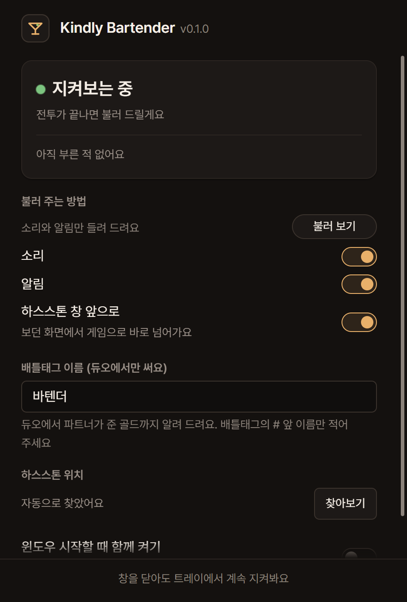

<a id="readme-top"></a>

[![Contributors][contributors-shield]][contributors-url]
[![Forks][forks-shield]][forks-url]
[![Stargazers][stars-shield]][stars-url]
[![Issues][issues-shield]][issues-url]
[![MIT License][license-shield]][license-url]

<br />
<div align="center">
  <a href="https://github.com/dev1f965x/kindly-bartender">
    
  </a>

  <h3 align="center">Kindly Bartender</h3>

  <p align="center">
    Calls you back to Hearthstone Battlegrounds the moment the shop reopens.
    <br />
    <a href="docs/product.md">Explore the docs »</a>
    ·
    <a href="https://github.com/dev1f965x/kindly-bartender/releases">Download</a>
    ·
    <a href="https://github.com/dev1f965x/kindly-bartender/issues/new?labels=bug">Report Bug</a>
    ·
    <a href="https://github.com/dev1f965x/kindly-bartender/issues/new?labels=feature">Request Feature</a>
  </p>
</div>

<details>
  <summary>Table of Contents</summary>
  <ol>
    <li>
      <a href="#about-the-project">About The Project</a>
      <ul>
        <li><a href="#built-with">Built With</a></li>
      </ul>
    </li>
    <li>
      <a href="#getting-started">Getting Started</a>
      <ul>
        <li><a href="#prerequisites">Prerequisites</a></li>
        <li><a href="#installation">Installation</a></li>
      </ul>
    </li>
    <li><a href="#usage">Usage</a></li>
    <li><a href="#roadmap">Roadmap</a></li>
    <li><a href="#license">License</a></li>
    <li><a href="#disclaimer">Disclaimer</a></li>
    <li><a href="#contact">Contact</a></li>
    <li><a href="#acknowledgments">Acknowledgments</a></li>
  </ol>
</details>

## About The Project

<div align="center">
  
</div>

In Battlegrounds the combat phase plays itself, so players alt-tab away and return late to
the shop, where the remaining seconds decide how much gold is spent. The game gives no
sound when the shop reopens, and a minimised window gives no indication at all.

This app waits in the tray and prompts you back.

- Plays a sound, shows a Windows notification, and brings Hearthstone to the front the
  moment combat ends. Each of the three can be switched off on its own.
- In Duos it calls again when a teammate's gold reaches you mid-shop.
- Says what it is doing: watching, waiting for the game, or unable to find the install.
- Starts with Windows, in the tray, if you ask it to.
- Updates itself from a signed release.

It reads `Power.log`, the log the game writes when `log.config` asks it to, and turns that
logging on for you. **Nothing is read from the game's memory and no input is sent to it.**
Bringing the window forward is what Alt+Tab does. The app never plays for you, and it is
not a deck tracker, an overlay, or a statistics site.

<p align="right">(<a href="#readme-top">back to top</a>)</p>

### Built With

[](https://tauri.app/)
[](https://www.rust-lang.org/)
[](https://react.dev/)
[](https://www.typescriptlang.org/)
[](https://vite.dev/)
[](https://playwright.dev/)
[](https://vitest.dev/)
[](https://biomejs.dev/)
[](https://docs.github.com/actions)

<p align="right">(<a href="#readme-top">back to top</a>)</p>

## Getting Started

### Prerequisites

- Windows 10 or 11, with the WebView2 runtime both already carry
- Hearthstone, installed anywhere

To build it yourself: [Node.js](https://nodejs.org) 24, [Rust](https://rustup.rs) stable,
and the [Tauri prerequisites](https://tauri.app/start/prerequisites/).

### Installation

1. Download the installer from the
   [latest release](https://github.com/dev1f965x/kindly-bartender/releases/latest).
2. The build is unsigned, so Windows SmartScreen warns once: **More info** → **Run anyway**.
3. Start the app, then **restart Hearthstone once**. The game reads its logging setting at
   launch, and the window says so until a log is being read.

From source:

```sh
git clone https://github.com/dev1f965x/kindly-bartender.git
cd kindly-bartender
npm install
npm run tauri dev
```

<p align="right">(<a href="#readme-top">back to top</a>)</p>

## Usage

The app lives in the tray. The icon's tooltip carries the current state, a left click opens
the window, and its menu has 창 열기 and 종료. Closing the window leaves it watching.

- **불러 보기** plays the sound and the notification, so the settings can be tried without a
  game running.
- **배틀태그 이름** is the name before the `#`. It is needed only for the Duos gold call.
- **하스스톤 위치** is found on its own; set it by hand when the game lives somewhere unusual.

The window, the tray tooltip, and the notifications are in Korean.

<p align="right">(<a href="#readme-top">back to top</a>)</p>

## Roadmap

- [x] 1.0.0 — combat ended, Duos gold, sound, notification, focus
- [x] 1.0.0 — updates itself from GitHub Releases
- [ ] 1.1.0 — a teammate's card passed in Duos, once confirmed against a real log
- [ ] later — a sound per moment, and quiet while the game is already in front

See the [open issues](https://github.com/dev1f965x/kindly-bartender/issues) for the full list.

<p align="right">(<a href="#readme-top">back to top</a>)</p>

## License

Distributed under the MIT License. See [`LICENSE`](LICENSE).

<p align="right">(<a href="#readme-top">back to top</a>)</p>

## Disclaimer

Not affiliated with, endorsed by, or connected to Blizzard Entertainment. Hearthstone is a
trademark of Blizzard Entertainment, Inc. The app reads a log file the game itself writes,
after turning that logging on through the game's own `log.config`; it reads no memory,
sends the game no input, and plays nothing on your behalf. Those log settings are internal
to the game rather than a supported interface, so a patch can stop a signal from being
recognised.

<p align="right">(<a href="#readme-top">back to top</a>)</p>

## Contact

[@dev1f965x](https://github.com/dev1f965x) — https://github.com/dev1f965x/kindly-bartender

<p align="right">(<a href="#readme-top">back to top</a>)</p>

## Acknowledgments

- [Pretendard](https://github.com/orioncactus/pretendard) — SIL Open Font License 1.1, see [`licenses/`](licenses)
- [Shields.io](https://shields.io)
- [Best-README-Template](https://github.com/othneildrew/Best-README-Template)

<p align="right">(<a href="#readme-top">back to top</a>)</p>

[contributors-shield]: https://img.shields.io/github/contributors/dev1f965x/kindly-bartender.svg?style=for-the-badge
[contributors-url]: https://github.com/dev1f965x/kindly-bartender/graphs/contributors
[forks-shield]: https://img.shields.io/github/forks/dev1f965x/kindly-bartender.svg?style=for-the-badge
[forks-url]: https://github.com/dev1f965x/kindly-bartender/network/members
[stars-shield]: https://img.shields.io/github/stars/dev1f965x/kindly-bartender.svg?style=for-the-badge
[stars-url]: https://github.com/dev1f965x/kindly-bartender/stargazers
[issues-shield]: https://img.shields.io/github/issues/dev1f965x/kindly-bartender.svg?style=for-the-badge
[issues-url]: https://github.com/dev1f965x/kindly-bartender/issues
[license-shield]: https://img.shields.io/github/license/dev1f965x/kindly-bartender.svg?style=for-the-badge
[license-url]: https://github.com/dev1f965x/kindly-bartender/blob/main/LICENSE
